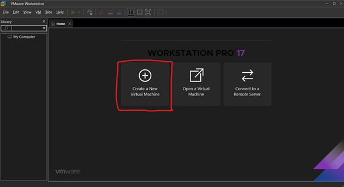
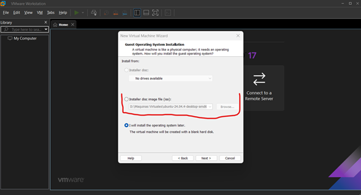
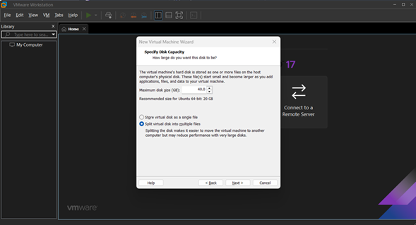
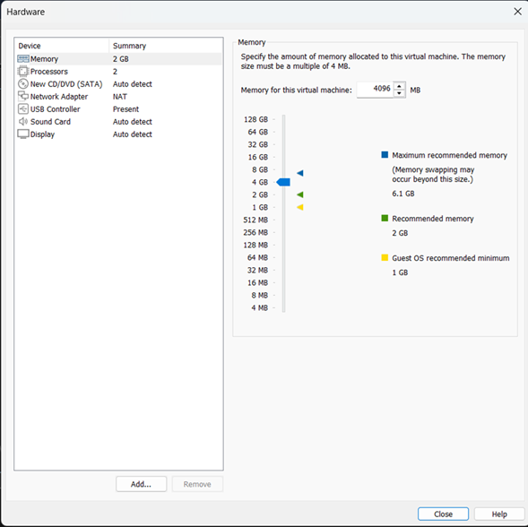
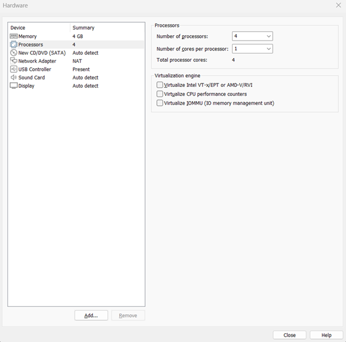

# lab-ubuntu-vmware

# 🐧 Laboratorio – Instalación de Ubuntu en VMware

Implementación de un sistema operativo Linux Ubuntu en un entorno virtualizado utilizando VMware Workstation.

Este laboratorio hace parte de mi ruta de aprendizaje en **Sistemas Operativos, Infraestructura y Ciberseguridad**.

---

## 🎯 Objetivo del laboratorio

Crear una máquina virtual desde cero, configurar sus recursos hardware e instalar correctamente Ubuntu Linux para construir un entorno de práctica profesional.

---

## 🧠 Habilidades demostradas

- Virtualización de sistemas operativos
- Instalación de Linux en entorno empresarial simulado
- Configuración de hardware virtual (CPU, RAM, Disco)
- Configuración de red NAT
- Documentación técnica de laboratorio
- Buenas prácticas de entornos de prueba

---

## 🛠️ Tecnologías utilizadas

| Herramienta        | Uso                        |
| ------------------ | -------------------------- |
| VMware Workstation | Virtualización             |
| Ubuntu Desktop LTS | Sistema Operativo invitado |
| Windows 11         | Sistema operativo host     |

---

## 💻 Configuración de la máquina virtual

| Recurso    | Configuración |
| ---------- | ------------- |
| RAM        | 4 GB          |
| CPU        | 4 núcleos     |
| Disco duro | 40 GB         |
| Red        | NAT           |

---

## 🚀 Procedimiento general

1. Creación de nueva máquina virtual en VMware  
2. Carga de la imagen ISO de Ubuntu  
3. Configuración de hardware virtual  
4. Instalación del sistema operativo  
5. Creación de usuario administrador  
6. Validación del entorno Linux operativo  

---

## 📸 Evidencia del laboratorio

### Creación de máquina virtual:

### Montar ISO Ubuntu:

### Configuracion espacio en disco:

### Configuracion de espacio en memoria RAm:

### Configuracion de procesadores:

---

## 🔐 Importancia profesional

La virtualización es una competencia fundamental en áreas como:

- Administración de sistemas
- Cloud Computing
- DevOps
- Ciberseguridad
- Soporte TI

Este laboratorio representa el inicio de la construcción de mi **Home Lab de Linux y Seguridad Informática**.

---

## 📌 Próximos laboratorios

- Administración básica de Linux
- Instalación de Kali Linux
- Redes en máquinas virtuales
- Hardening de sistemas Linux
- Laboratorio de ciberseguridad

---

## 👨‍💻 Autor

**Aley Cabrera**

🎓 Estudiante de Ingeniería Mecatrónica y Telemática en @unibarranquilla_

Estudiante autodidacta de mis interese

Intereses: Sistemas, Cloud, Ciberseguridad y Desarrollo

#IUB #UniBarranquilla #IngenieríaMecatronica #Telematica 
#EducaciónSuperior #Colombia #TechStudent

---

⭐ Si este laboratorio te resulta útil, ¡no olvides darle estrella al repositorio!

