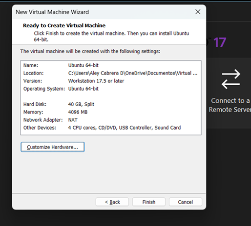
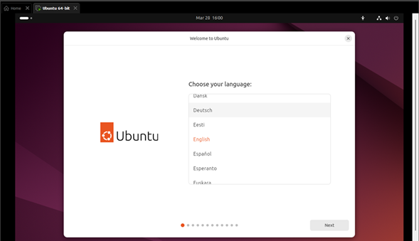
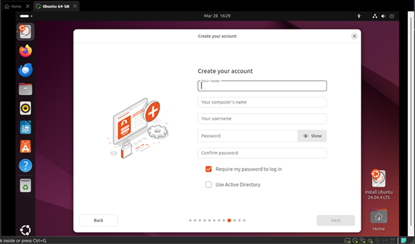
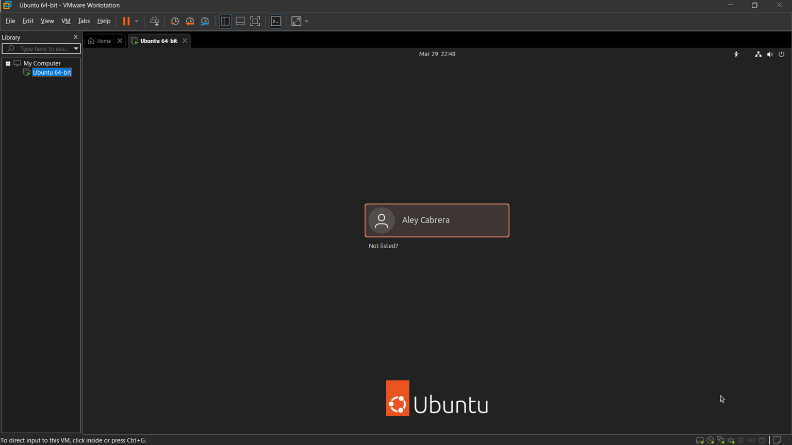
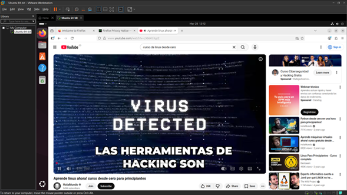

# 🐧 Ubuntu Virtual Lab – VMware Deployment

Implementación de un entorno Linux virtualizado utilizando VMware como parte de mi proceso de formación en **Sistemas, Infraestructura y Ciberseguridad**.

Este laboratorio marca el inicio de la construcción de mi **Home Lab profesional**, orientado a prácticas reales de administración de sistemas, redes y seguridad informática.

---

## 📌 Descripción del proyecto

En este laboratorio diseñé e implementé una máquina virtual desde cero, desplegando Ubuntu Desktop LTS en un entorno controlado.  

El objetivo fue simular un escenario real de provisión de infraestructura, aplicando buenas prácticas en asignación de recursos, virtualización y conectividad.

---

## 🎯 Objetivos técnicos

- Implementar un sistema Linux en entorno virtualizado  
- Configurar recursos de hardware de forma eficiente  
- Establecer conectividad de red mediante NAT  
- Validar la operatividad del sistema  
- Construir una base para futuros laboratorios de ciberseguridad  

---

## 🧠 Competencias desarrolladas

- Virtualización de sistemas operativos  
- Instalación y despliegue de Linux  
- Configuración de recursos (CPU, RAM, almacenamiento)  
- Networking básico (NAT – Network Address Translation)  
- Documentación técnica orientada a proyectos  
- Preparación de entornos de laboratorio  

---

## 🛠️ Stack tecnológico

| Tecnología         | Rol en el laboratorio        |
| ------------------ | ---------------------------- |
| VMware Workstation | Plataforma de virtualización |
| Ubuntu Desktop LTS | Sistema operativo invitado   |
| Windows 11         | Sistema host                 |

---

## ⚙️ Configuración del entorno

| Recurso | Valor asignado |
| ------- | -------------- |
| RAM     | 4 GB           |
| CPU     | 4 vCPU         |
| Disco   | 40 GB          |
| Red     | NAT            |

**Justificación técnica:**
Configuración equilibrada que permite un rendimiento estable del sistema sin comprometer los recursos del host.

---

## 🚀 Flujo de implementación

1. Creación de máquina virtual en VMware  
2. Integración de imagen ISO de Ubuntu  
3. Configuración de hardware virtual  
4. Instalación del sistema operativo  
5. Creación de usuario administrador  
6. Validación del entorno operativo  

---

## 📸 Evidencia del laboratorio

### Creación de máquina virtual:

### Montar ISO Ubuntu:

### Configuracion espacio en disco:

### Configuracion de espacio en memoria RAm:

### Configuracion de procesadores:

### Resultados de configuracion:

### Configuraciones Basicas de linux:

### Creacion de usuario para Ubuntu:

### Inicio de usuario para entorno Linux Ubuntu:

### Entorno final ya creado para Ubuntu:

---

## 🔐 Enfoque profesional

La virtualización es una tecnología fundamental en entornos modernos de:

- Administración de sistemas  
- Cloud Computing  
- DevOps  
- Ciberseguridad  
- Soporte técnico  

Este laboratorio representa la base para escenarios más complejos como:

- Hardening de sistemas Linux  
- Simulación de ataques y defensas  
- Implementación de servicios (SSH, Web, DNS)  
- Arquitecturas de laboratorio multi-VM  

---

## 🔮 Roadmap (Próximos pasos)

- [ ] Administración avanzada de Linux  
- [ ] Instalación y uso de Kali Linux  
- [ ] Configuración de redes virtuales (Bridge / Host-Only)  
- [ ] Hardening de Ubuntu  
- [ ] Laboratorio de pentesting básico  
- [ ] Automatización con Bash  

---

## 👨‍💻 Autor

**Aley Cabrera**

🎓 Estudiante de Ingeniería Mecatrónica y Telemática en @unibarranquilla_

Estudiante autodidacta de mis interese

**Intereses:**  
Sistemas | Cloud | Ciberseguridad | Desarrollo

#IUB #UniBarranquilla #IngenieríaMecatronica #Telematica 
#EducaciónSuperior #Colombia #TechStudent

---

## ⭐ Valor del proyecto

Este repositorio documenta el inicio de mi entorno de laboratorio personal, el cual evolucionará hacia un entorno de pruebas enfocado en seguridad ofensiva y defensiva.

---

⭐ Si este laboratorio te resulta útil, ¡no olvides darle estrella al repositorio!

